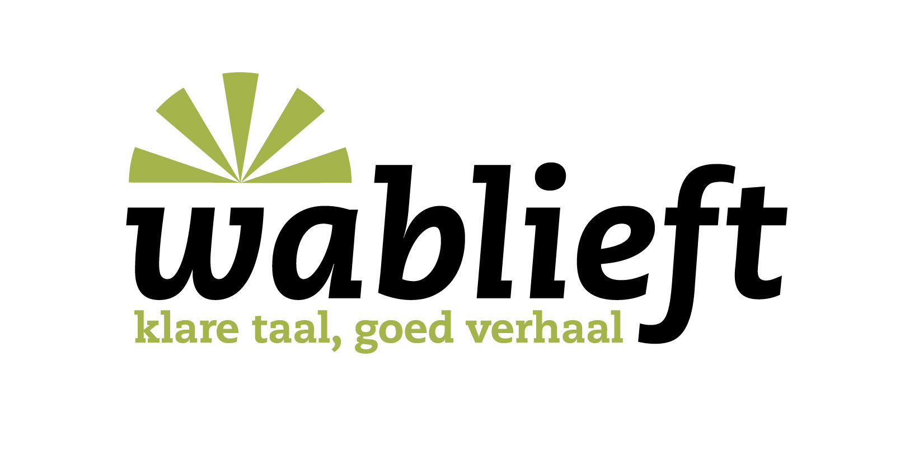
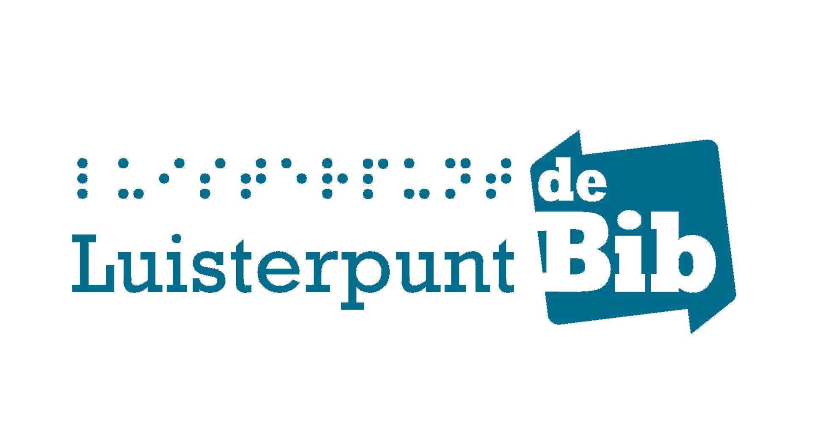
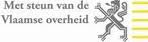
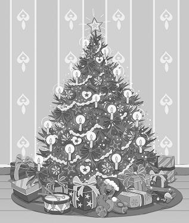

<?xml version="1.0" encoding="utf-8"?><!DOCTYPE html PUBLIC "-//W3C//DTD XHTML 1.0 Strict//EN" "http://www.w3.org/TR/xhtml1/DTD/xhtml1-strict.dtd"><html xmlns="http://www.w3.org/1999/xhtml" xml:lang="en-US">
   <head>
      <meta http-equiv="Content-Type" content="application/xhtml+xml; charset=utf-8"/>
      <title>Kerstekind</title>
      <meta name="dc:identifier" content="58fb8b61-a9f0-466d-ae05-789d51f7da5a"/>
      <meta name="dtb:generator"
            content="Tobi and the Urakawa SDK: the open-source DAISY multimedia authoring toolkit"/>
      <meta name="dc:language" content="nl-BE"/>
      <meta name="dc:title" content="Kerstekind"/>
      <meta name="dc:creator" content="Diane De Keyzer"/>
      <meta name="dc:publisher" content="Luisterpunt"/>
      <meta name="dc:source" content="978 90 223 2657 2"/>
      <meta name="dtb:SourceTitle" content="Kerstekind"/>
      <meta name="dtb:SourcePublisher" content="Manteau"/>
      <meta name="dtb:SourceDate" content="2011"/>
      <meta name="dtb:Narrator" content="Diane De Keyzer"/>
      <meta name="dtb:Producer" content="Luisterpunt"/>
      <meta name="dc:date" content="2011-08-24"/>
      <meta name="dc:type" content="Text"/>
      <meta name="dtb:Revision" content="9"/>
      <meta name="dtb:RevisionDate" content="2011-09-01"/>
      <meta name="Generator" content="odt2daisy 2.1.1 by Vincent Spiewak"/>
      <link rel="stylesheet" type="text/css" href="default.css"/>
   </head>
   <body>
      <h1 class="title" id="h1classtitle">
         <a href="0001.smil#doctitleText">Kerstekind</a>
      </h1>
      
Kerstekind

      
Diane De Keyzer

      

         1
         <h1 id="dtb_4">Titelpagina</h1>
         
Kerstekind.

         
Geschreven door Diane De Keyzer.

         
Uitgegeven door Manteau in het jaar 2011.

         
Dit Daisy- Braille-boek is geproduceerd door Luisterpunt.

         
ISBN : 978 90 223 2657 2

         2
         
2011 Uitgeverij Manteau / WPG Uitgevers België nv, Mechelsesteenweg 203, B-2018 Antwerpen en Diane De Keyzer

         

					       www.manteau.be
					        - 
					       info@manteau.be
				     

         
Vertegenwoordiging in Nederland: Standaard Uitgeverij Nederland Herengracht 370/372

         
NL-1 016 CH Amsterdam

         
Deze reeks kwam tot stand in samenwerking met Wablieft

         
Wablieft.

         
Kardinaal Mercierplein 1

         
2800 Mechelen

         

					       www.wablieft.be
					        - 
					       boeken@wablieft.be
				     

         
Projectpartners:

         
Wablieft/Vocvo, Stichting Lezen, LOCUS, Federatie Centra Basiseducatie, Centra Volwassenenonderwijs, Luisterpuntbibliotheek.

         
Tekstadvies: Wablieft

         
Omslagontwerp: Hanna Maes

         
Foto omslag: Diane De Keyzer

         
Foto’s binnenwerk: iStockphoto (kerstboom en Heilig Hart), Katrien Van den Broeck (Brabants trekpaard), Marc Cauwenbergh (dorp, huis van peet, graf, dreef)

         
Vormgeving binnenwerk: Ready2Print

         
Druk: Ter Roye NV Oostkamp

         

					       Alle rechten voorbehouden. 
					       Niets uit deze uitgave mag worden verveelvoudigd, opgeslagen in een geautomatiseerd gegevensbestand of openbaar gemaakt, in enige vorm of op enige wijze, hetzij elektronisch, mechanisch, door fotokopieën, opnamen of op welke wijze ook, zonder voorafgaande schriftelijke toestemming van de uitgever.
				     

         
ISBN 978 90 223 2657 2

         
D/2011/0034/472

         
NUR 300

         

					       
               Afbeelding 1: Logo Wablieft
               
            
					       
               Afbeelding 3: Logo Luisterpunt
               
            
					       
               Afbeelding 2: Logo Met steun van de vlaamse overheid
               
            
				     

      

      

         4
         <h1 id="dtb_51">Opdracht</h1>
         
Een beetje verleden voor de toekomst. Deze verhalen zijn voor Louis en Lotte.

         

					       
               Afbeelding 4: Versierde kerstboom
               
            
				     

      

      

         5
         <h1 id="dtb_59">Kerstekind</h1>
         
‘Nieuwjaar’, zegt de dokter.

         
‘Op 1 januari komt het kindje.’

         

					       Maar het kindje zelf denkt daar anders over. 
					       Het weet al heel goed wat het wel en wat het niet wil.
				     

         
Kerstmis is toch zoveel mooier.

         
En 1958 is ook beter dan 1959.

         

					       1958 is het jaar van de Expo in Brussel. 
					       Het jaar van de zilveren bollen van het Atomium.
				     

         
Zilveren en gouden ballen en slingers en lichtjes in een boom.

         
Dus wordt het Kerstmis!

         

					       Een perfecte dag om in de wereld te stappen. 
					       Waarom wachten tot 1 januari?
				     

         

					       Op 25 december branden er overal kaarsjes en is het warm in de harten van de mensen. 
					       Voortmaken dus!
				     

         6
         
Ma en pa, die dan nog geen ma en pa zijn, twijfelen nog.

         

					       Maar op kerstavond weet ma beter ... 
					       Hun eerste kindje wordt een kerstekind!
				     

         

					       De pakjes liggen eenzaam onder de boom. 
					       Niemand is thuis.
				     

         
Pa en ma zijn in het ziekenhuis.

         
De geboorte gaat niet echt vlot.

         
Het kind krijgt geen lucht.

         
Maar kerstekinderen zijn koppig en taai.

         

					       Ze willen nu eenmaal jarig zijn op kerstdag. 
					       ‘Het is een meisje’, zegt de dokter.
				     

         

					       Ma wil weten of het alles heeft: vingertjes tien, teentjes tien en twee oogjes om te zien. 
					       ‘Goed voorzien van oren en poten’, lacht pa. 
					       Trots is hij, pa, op zijn dochter zonder naam. 
					       Die dochter ben ik.
				     

         
Ik weet meteen dat het goed is.

      

      

         7
         <h1 id="dtb_100">Rel over een naam</h1>
         
Ma en pa hebben al lang een idee voor een naam.

         
De non in het ziekenhuis heeft een ander idee.

         

					       Zij stapt vrolijk de kamer binnen. 
					       Kerstekinderen maken nonnen altijd blij. 
					       Ma is moe en rust.
				     

         

					       De non lacht breed onder haar witte kap. 
					       ‘Ahaaaaaaa ons Noëllake, zie!’ 
					       kirt ze vrolijk. 
					       Ma en pa kijken elkaar aan en zuchten. 
					       ‘Noël(la)’ is Frans voor ‘Kerstmis’.
				     

         
Dat weten pa en ma ook.

         
‘Neen, Noëlla zal ze niet heten’, zegt mijn pa rustig.

         
De non gelooft haar oren niet.

         

					       ‘Hoezo, een kerstekind en geen Noëlla?’ 
					       vraagt ze.
				     

         
Haar lach is weg.

         8
         
blanco pagina

         9
         
Ze kijkt sip.

         
Haar kap lijkt nog witter.

         
‘Neen, geen Noëlla’, antwoorden de kersverse ouders beslist.

         

					       ‘En hoe zal het meisje dan wel heten?’ 
					       wil de non weten.
				     

         
‘Diana, roepnaam Diane, dat kozen wij’, zeggen de ouders.

         

					       ‘Maar dat kan toch niet!’ 
					       roept de non. 
					       ‘Dat kan je niet menen’, zegt ze nog eens. 
					       Ze verslikt zich in haar eigen woorden. 
					       ‘En toch zal het een Diane zijn’, zegt mijn vader.
				     

         
Hij laat zich door de nonnenkap niet van de wijs brengen.

         
Nonnen dachten toen nog dat zij altijd gelijk hadden.

         

					       ‘Je weet toch dat Diana de naam is van een heidense godin uit Rome?’ 
					       pruttelt de zuster tegen.
				     

         
Ze geeft zich niet zomaar gewonnen.

         
‘Dit kind is geboren op de geboortedag van Jezus’, probeert ze nog.

         10
         
Maar ma is moe.

         
En als ma moe is, gebruikt ze weinig woorden.

         
De nonnenkap druipt af.

         
Diane is dus Diane en niet anders!

         
Ik ben nog geen uur oud en ik heb al een non verdriet gedaan ...

         
Op de eerste dag van het nieuwe jaar mag ik de eerste keer mee met de moeder van pa: mijn peet.

         
Wanneer de pastoor mij doopt, houdt zij me in haar armen.

         
Zij vindt mijn naam mooi.

         
Zij is lief.

         
Door de sneeuw, over de berg is ze met de fiets gekomen om mij te zien.

         
Peet is bijzonder voor mij ... heel bijzonder.

      

      

         11
         <h1 id="dtb_156">Bij boer Juul</h1>
         
Ma en pa nemen me mee naar de grote boerderij van boer Juul.

         
Die ligt in het dorp van pa.

         

					       Ooit waren er in het dorp vier brouwers. 
					       Ook de hoeve van boer Juul was vroeger van een brouwer.
				     

         
De hoeve is heel mooi.

         
Ze ligt tussen groene weiden.

         
Om bij de hoeve te komen, moet je door een dreef met oude dikke bomen.

         
Alle gebouwen van de hoeve vormen samen een vierkant.

         

					       Ma en pa huren er een klein huisje. 
					       Wanneer ik thuiskom, ligt het dorp onder een wit tapijt van sneeuw.
				     

         
Alles is stil.

         

					       Ik slaap en eet en ik eet en slaap. 
					       Het wordt lente.
				     

         12
         
blanco pagina

         13
         
De bomen in de dreef dragen mooie witte bloesems.

         
Het wordt zomer.

         
De zon brandt op de velden.

         
In de herfst kleurt de dreef goud.

         
En dan komt weer de winter.

         

					       Ma bakt een taart met één kaarsje erop. 
					       Ik groei en zet mijn eerste stappen op het erf van boer Juul.
				     

         
Boer Juul heeft een vrouw, Linda.

         
Zij is de boerin.

         
Zij melkt de koeien.

         
In de winter staan de koeien met hun kalfjes in de stal.

         
Het is altijd warm in de stal.

         
Het ruikt er lekker, naar hooi en verse melk.

         14
         
blanco pagina

      

      

         15
         <h1 id="dtb_193">Lief</h1>
         
Juul en Linda hebben vier dochters.

         
De ene is nog mooier dan de andere.

         
Drie van de meisjes hebben een lief.

         

					       Maar Lief is de liefste. 
					       Zij heeft geen lief.
				     

         
Zij is anders dan haar zussen.

         

					       Lief heeft zachte armen om in te verdwijnen. 
					       Maar Lief is soms ziek.
				     

         
Dan valt ze plots en maakt ze rare bewegingen.

         
Ik heb het wel eens gezien.

         
Ma vertelt me dat Lief de vallende ziekte heeft.

         
Dat begrijp ik.

         
Daarom is Lief zo lief.

         
Lief neemt me mee in de grote woonkamer van de boerderij.

         
Het plafond is er hoog.

         16
         
De vloer is rood.

         
Er staat een mooie grote klok.

         
Die tikt zwaar de uren weg.

         
Op elk uur is er een bimbam.

         
Ik kan uren kijken naar die klok.

         
Ik wacht op elke bimbam.

         
Maar Lief heeft altijd wel iets wat ik moet zien.

         
Kat heeft kleine poesjes.

         
Er zijn kuikentjes in het kippenhok.

         
De varkens krijgen hun bad.

         
Ik ben geen bang kind, maar voor de varkens ben ik bang.

         
Ze zijn wild.

         
Ze stormen het erf op.

         
Dan moet ik binnen blijven.

         
Het erf is dan van hen.

         

					       Ik ben bang, maar het is ook wel spannend. 
					       Met mijn neus tegen het raam kijk ik naar de varkens.
				     

         
Ze houden van modder.

         

					       In geen tijd wordt hun roze vel zo vuil als wat. 
					       Boer Juul zegt dat ze zich zo proper maken.
				     

         17
         

					       Ik begrijp er niks van. 
					       Vuil is toch niet proper?
				     

         

					       Op een dag heeft Lief een verrassing voor me. 
					       Ze wil me iets laten zien.
				     

         
Ze neemt me mee naar de kleine kelder.

         
Die kelder zit half onder de grond.

         
Het is er altijd koel.

         
Ze toont me een grote witte kist.

         
‘Nu moet je goed opletten’, zegt ze.

         
‘Dit is een toverkist.’

         
Ze opent het deksel.

         
Ik zie hoe er damp uit de kist komt.

         

					       Dit is echt een toverkist! 
					       Lief buigt zich over de kist. 
					       Ze haalt er iets uit.
				     

         

					       ‘Sluit je ogen’, vraagt ze me. 
					       ‘Hier,’ zegt ze, ‘dit is een tomaat.’
				     

         
In mijn handen voel ik een ijskoude bal.

         
Dit is toch geen tomaat?

         
Een tomaat is zacht en glad, denk ik.

         
Als ik mijn ogen open, zie ik een tomaat van ijs.

         
Zoiets heb ik nog nooit gezien ...

         18
         
‘Dit is een diepvrieskist’, weet Lief.

         
‘Vanaf nu bewaren we het varken niet meer in het zout.

         
We stoppen het in deze kist.’

         

					       ‘Een varken in deze kist?’ 
					       vraag ik.
				     

         
Ik kan haar maar moeilijk geloven.

         
Lief maakt wel eens een grapje.

         
Ze lacht dan al haar tanden bloot.

         
Ik ben graag bij Lief.

         
Ik ben meestal bij ma.

         
Maar als pa thuis is, dan ben ik altijd bij pa.

      

      

         19
         <h1 id="dtb_275">Pa ruikt naar hout</h1>
         
Pa is groot en sterk.

         

					       Pa kan alles. 
					       Pa durft alles.
				     

         
Hij is nooit bang.

         

					       Hij is zelfs niet bang van de wilde varkens. 
					       Ik ben ook niet snel bang.
				     

         
Ma is bang van het donker.

         

					       Van boer Juul mogen we eieren rapen. 
					       Soms stappen we in het donker naar het kippenhok.
				     

         
Ma is dan bang.

         
Ik voel het en ik babbel heel de tijd.

         
Zo babbel ik haar schrik weg.

         
Ze hoeft niet bang te zijn.

         
Ik ben bij haar.

         
Ik leer van pa dat bang zijn niet moet.

         

					       Als het lente is, legt pa zaadjes in de tuin. 
					       Ik help graag.
				     

         20
         
‘Er zullen plantjes groeien’, zegt pa.

         

					       ‘Sla en prei en kool.’ 
					       En het is echt waar! 
					       Pa kan dat!
				     

         
Hij kan alles doen groeien.

         
Ma maakt lekkere soep.

         
Haar tomatensoep is zelfs lekkerder dan die van peet.

         

					       Pa is een timmerman. 
					       Hij werkt voor een baas.
				     

         
Hij vertrekt ’s morgens als ik nog slaap.

         
’s Avonds slaap ik niet voor ik hem zie.

         

					       Als hij thuis is, help ik pa. 
					       Hij werkt altijd.
				     

         

					       Hij heeft een werkbank. 
					       Die is echt heel oud.
				     

         
Ze was nog van zijn grootvader.

         
Boven de bank hangen houten bakjes met vijzen en spijkers erin.

         
Pa heeft ook schaven en beitels en hamers en zagen.

         
Met een schaaf maakt hij mooie krullen van hout.

         21
         
Pa ruikt altijd naar hout.

         

					       Zijn trui ruikt naar hout en zijn haar ook. 
					       Hij werkt ook graag op het land.
				     

         
Dat doet hij samen met Jeanne, het paard van peet.

         22
         
blanco pagina

      

      

         23
         <h1 id="dtb_330">Het paard van peet</h1>
         
Peet woont vlakbij.

         
Haar hoeve is veel kleiner dan die van boer Juul.

         
Boer Juul is rijk.

         
Peet is dat niet.

         
Ik fiets met mijn driewieler op het pad tussen de weiden.

         
Aan het einde van het pad is de grote steenweg.

         
Verder mag ik niet.

         
Ik wacht tot peet mij ziet.

         
Peet is boerin, net als Linda.

         
Maar peet heeft geen boer.

         
Haar man, mijn grootvader, is dood.

         
Ik ken hem alleen van een foto.

         
Omdat er geen man is op de hoeve, helpt mijn vader.

         
Vooral als Jeanne van stal moet, moet pa helpen.

         24
         
blanco pagina

         25
         
Jeanne is een trekpaard.

         
Ze heeft een grappige korte staart.

         
Ze is wel tien keer sterker dan pa.

         

					       Zij kan de ploeg trekken op het veld van peet. 
					       Heel af en toe mag ik mee op de rug van Jeanne.
				     

         
Een paard heeft hoeven.

         
Onder die hoeven zitten hoefijzers.

         

					       Die verslijten, net als onze schoenen. 
					       Daarom moet pa met Jeanne naar de smid in het dorp.
				     

         
Met een flinke zwaai zet pa mij op de rug van het grote dier.

         
Jeanne draagt geen zadel.

         

					       De haren op haar rug prikken in mijn billen. 
					       De rug van Jeanne is zo breed.
				     

         
Mijn benen zijn veel te kort.

         
Ik hou mij stevig vast aan de manen van Jeanne.

         
Haar geur prikt in mijn neus.

         
Pa zit achter mij.

         
Hij leidt Jeanne met korte woorden door de straten van het dorp.

         26
         
blanco pagina

         27
         
Ik ben niet bang.

         
Ik ben fier.

         
Ik wil dat iedereen ons ziet.

         

					       Ik met mijn pa, hoog op het paard van peet. 
					       Alle mensen kennen pa, en ze kennen Jeanne.
				     

         
De smid woont voorbij dokter Van Laer in het Kerkestraatje.

         
De smid is een grote man met een schort van leer.

         
Hij kijkt boos.

         

					       Zo kijkt hij altijd, ook als hij niet boos is. 
					       ‘Menneke, menneke. 
					       Zijt gij met het paard gekomen?’ 
					       wil hij weten.
				     

         
Ik knik beslist.

         

					       ‘Menneke, menneke’, herhaalt hij weer. 
					       Dan moet Jeanne tussen de palen staan, met één been omhoog.
				     

         
De smid staat voor het vuur.

         
Hij houdt het hoefijzer in het vuur.

         
Het gloeit rood.

         
De voet van Jeanne rookt.

         
Ik wil weten of ze geen pijn heeft.

         28
         
‘Maar neeje, menneke, neeje potverdomme’, gromt de smid.

         

					       De vrouw van de smid heeft een café en ik mag er een groene limonade drinken. 
					       Groene limonade is het aller-allerlekkerste op de hele wereld.
				     

         
En de vrouw van de smid weet dat heel goed.

      

      

         29
         <h1 id="dtb_402">Het verdriet van een kind</h1>
         

					       Groene limonade is heel erg lekker. 
					       En horlicks is heel erg slecht.
				     

         

					       Horlicks is een drank met poeder van melk. 
					       Horlicks krijg ik op school.
				     

         
En school vind ik niet leuk.

         
De juf is niet leuk.

         
Er zijn te veel kinderen.

         
Ma laat me aan de poort achter.

         
Ze zegt dat ik flink moet zijn.

         
Dat wil ik helemaal niet.

         
Ik wil gewoon wenen en wenen en blijven wenen.

         
Ma moet me komen halen.

         

					       Ik wil naar Lief, naar peet, naar Jeanne. 
					       Ik wil zelfs uren in de hoek staan, als ik maar niet naar school hoef.
				     

         
School is stom.

         
Heel stom.

         30
         
Ik moet er dit en mag niet dat.

         
De juf heeft een stomme naam.

         
Een voornaam heeft ze niet.

         
En haar familienaam klinkt als ‘naar de knoppen’.

         
‘Ze heet Vannoppen’, zegt ma en ik moet aardig zijn tegen haar.

         

					       Ik wil helemaal niet aardig zijn tegen haar. 
					       Zij is ook niet aardig tegen mij.
				     

         
We moeten stomme spelletjes doen.

         

					       Ik denk dat de juf denkt dat we stom zijn. 
					       We moeten het zilverpapier van de chocolade sparen, voor de kindjes in Congo.
				     

         
Wat moeten de kindjes in Congo met zilverpapier?

         
Die willen een lekkere koek, of een mooie broek.

         
Ze zijn arm en zwart.

         
Wat moeten ze met zilverpapier?

         
In de zandbak van de klas maken we een Congolees dorp.

         
Daarvoor moeten we weer sparen.

         

					       In de doosjes smeerkaas met de rode lachende koe zitten punten voor het dorp. 
					       Maar het is niet eens een echt dorp.
				     

         31
         
De hutjes zijn van karton.

         
De bomen ook.

         
Ik vind dit niet leuk.

         
We moeten stofjes uitpluizen en de draadjes worden nieuwe kussens.

         
Ik begrijp het niet.

         
We moeten liedjes zingen.

         
Ik ben niet eens blij.

         
Hoe kan ik dan zingen?

         
En dan elke dag horlicks drinken.

         
Ik wil groene limonade.

         
Op een dag besluit ik dat het genoeg is geweest.

         32
         
blanco pagina

      

      

         33
         <h1 id="dtb_459">Kakbruine bottekes</h1>
         
Ma en pa bouwen een nieuw huis in het dorp van ma.

         
Het is 1964.

         
Ik ben al bijna zes jaar.

         

					       Pa werkt heel hard aan het nieuwe huis. 
					       Hij maakt de deuren en de ramen.
				     

         
Hij helpt de metsers en sjouwt met stenen en mortel.

         
Ook ma helpt waar ze kan.

         
Zo kunnen we wat geld sparen.

         
‘Want het leven is zo duur’, zucht ma meer dan eens.

         

					       Veel luxe is er niet in ons huis bij boer Juul. 
					       Toch is alles er.
				     

         
Ma is handig.

         
Ze maakt mooie kleedjes met rode en witte ruitjes voor de haard.

         
Ze naait kleertjes voor mijn poppen.

         34
         

					       Die kleertjes hebben ook witte en rode ruitjes. 
					       Ik wil graag een poppenwagen zoals in de winkel in de stad.
				     

         
Maar die is heel duur.

         

					       Ik krijg een poppenwagen van Sinterklaas. 
					       Hij is helemaal van hout.
				     

         
Zelfs de wieltjes zijn van hout.

         
Niemand heeft zo een bijzondere lichtgroene poppenwagen.

         
Nergens kan je die kopen.

         
Alleen de Sint kan die brengen.

         
Ik weet dat!

         
Mijn pop Rita weet dat ook.

         
Rita is helemaal geen mooie pop.

         
Ze heeft kort bruin haar.

         

					       De pop van mijn nichtje heet Barbie. 
					       Barbie heeft lange blinkende haren. 
					       Die pop heeft zelfs een vriendje.
				     

         
Hij heet Ken.

         
Op een dag bedenk ik dat mijn Rita veel mooier is zonder ogen.

         
En plots zijn ze weg, haar ogen.

         

					       ‘Waar zijn ze?’ 
					       wil ma weten.
				     

         35
         
Niemand weet het.

         
Zonder ogen is Rita vreemd.

         
Ze lijkt nu nog minder op Barbie.

         
Dat hoeft ook niet.

         

					       Ik lijk ook helemaal niet op mijn nichtje. 
					       Mijn nichtje is mooi.
				     

         
Ma wil graag dat ik mooi ben.

         

					       ‘Je bent een mooi meisje’, zegt ze vaak. 
					       Ik heb fijn wit haar.
				     

         
Ma doet het in een paardenstaartje.

         

					       Maar op een dag knipt kapper Luk het kort. 
					       ‘Net een jongetje’, zegt hij.
				     

         

					       ‘Ik ben wel een meisje!’ 
					       zeg ik kort. 
					       Weg is mijn haar.
				     

         
Ma krijgt het haar mee.

         

					       Het is netjes verpakt in een blauw papiertje. 
					       Soms kijkt ze er stiekem naar, naar mijn haar.
				     

         
Ik weet niet zeker of ze mij nog wel een mooi meisje vindt.

         
Op een dag wil ma naar de stad.

         
Heel af en toe moet ze weg uit het dorp van pa.

         36
         
blanco pagina

         37
         
Weg van de frisse lucht.

         
In de stad is het druk.

         
Alles toetert en schettert.

         
Ma vindt winkels leuk.

         
Ze fleurt helemaal op in de stad.

         

					       In een schoenwinkel moet ik laarsjes passen. 
					       Ze knellen allemaal.
				     

         
Ze zijn te klein.

         
Ze zijn allemaal te klein!

         
De mevrouw van de winkel knijpt in de tip van de schoen.

         
Weet ze dan niet dat ze ook in mijn teen knijpt?

         

					       ‘Deze passen heel goed!’ 
					       zegt de mevrouw tegen ma.
				     

         

					       Hoe kan zij dat nu weten, vraag ik me af. 
					       Heeft zij die schoenen al eens gepast? 
					       Weet zij wel hoe ze in je enkels bijten? 
					       En kijk eens naar die kleur!
				     

         
Geen gele of groene of rode laarsjes, maar enkel zwarte en bruine.

         
Bruin vind ik vies.

         
Het is de kleur van kaka.

         38
         
Kakbruine bottekes!!!

         
Ze gaan dicht met veters, die passen achter scherpe haakjes.

         
Ik wil helemaal geen laarsjes.

         
‘Het wordt winter’, zegt ma.

         
‘Je moet net als alle andere kinderen van je klas bottekes hebben.’

         
Waarom moet ik altijd alles doen zoals de andere kinderen?

         
Ik begrijp het niet.

         
Ik ben ik.

         

					       Ik ben niet zoals die andere kinderen. 
					       Ik vind die kinderen niet leuk.
				     

         
En ik vind die bottekes al helemaal niet mooi!

         
Ik moet ze dragen voor school.

         
Dat maakt ze nog lelijker.

         
School is vervelend.

         
Ik moet iets verzinnen.

         

					       In de bus op weg naar huis, maak ik een plan. 
					       Die bottekes moeten voor altijd in de vuilnisbak.
				     

         
De eerste dag dat ik die dingen moet dragen, gaan ze eraan.

         39
         
Dat is zeker.

         

					       De winter komt dat jaar maar heel langzaam. 
					       De herfst is zacht.
				     

         
Dan komen de regen en de sneeuw.

         

					       De bottekes lagen te wachten in hun doos. 
					       Nu moeten ze eruit.
				     

         
Ik zeg niets.

         
Ik trek geen vies gezicht.

         

					       Ik kijk niet eens naar de kakbruine bottekes. 
					       Wacht maar, denk ik.
				     

         
Ze knellen nog altijd.

         
Ma brengt mij zoals altijd met de fiets naar school.

         
Ik zit achteraan op de fiets van ma.

         
Daar zal het gebeuren.

         
Ma heeft flink de wind in de rug.

         
We zijn bijna aan de school.

         

					       Nu of nooit! 
					       denk ik en ik sluit mijn ogen.
				     

         
Ik steek mijn beide voeten tegelijk tussen de spaken van het achterwiel.

         
 

         
Nog nooit is ma zo snel gestopt.

         
Ze kan zich nog net recht houden.

         
Ma is niet blij.

         40
         

					       Ze is helemaal niet blij. 
					       Ze is razend!
				     

         
En mijn bottekes?

         

					       Die zijn alleen een heel klein beetje geschaafd. 
					       Mijn voeten doen pijn.
				     

         
Maar dat is niet erg.

         

					       Ik kan niet goed lopen. 
					       Dat is ook niet erg.
				     

         
Tranen komen niet.

         
Die dag kan ik niet meer naar school.

         
Ik moet in de hoek.

         

					       ‘Voor straf! 
					       En durf er niet uit te komen!’ 
					       zegt ma streng.
				     

         

					       ‘Weet jij wel hoeveel ik voor die bottekes betaald heb?’ 
					       wil ze weten.
				     

         
Ik zeg niets.

         

					       ‘Wat zal pa hiervan zeggen?’ 
					       vraagt ze.
				     

         
Tja, wat zal pa hiervan zeggen?

         
De hele dag zit ik in de hoek.

         
‘Draai je gezicht naar de muur’, bromt ma af en toe.

         
Ik hou van die hoek.

         
Hij is veel beter dan de school.

         41
         

					       Hij is veel rustiger dan juf ‘Naar de knoppen’. 
					       In mijn hoek kan ik dromen.
				     

         
Daar kan ik verhalen vertellen, zonder te spreken.

         
Verhalen zitten in je hoofd.

         
Niemand kan ze pakken.

         
Ze zijn lekker alleen van mij.

         42
         
blanco pagina

      

      

         43
         <h1 id="dtb_646">Naar het dorp van ma</h1>
         
Mijn favoriete snoepjes zijn muisjes en fruitkaramellen.

         
De roze karamellen met aardbei zijn zooo lekker.

         

					       Van de muisjes vind ik de zwarte het lekkerst. 
					       Ik wil er zoveel van snoepen als ik kan. 
					       Maar veel snoepen mag niet van ma.
				     

         
‘Dan word je dik’, zegt ze.

         
Ho maar, denk ik.

         
Wat je zegt, dat ben je zelf.

         
De buik van ma is pas dik.

         
Zou ze zelf stiekem te veel snoepen?

         
‘Er komt een broertje of een zusje voor jou’, zeggen ma en pa.

         
Het kindje zit in de buik van ma.

         

					       Dus haar buik is toch niet dik door de muisjes! 
					       ‘We gaan in het nieuwe huis wonen als het zomer is.
				     

         44
         
We verhuizen naar Laar.’

         
Laar is het dorp van ma.

         
‘En jij gaat naar een nieuwe school’, zegt pa nog.

         
Dat is wel veel nieuws voor een kind van zes.

         
Met de school kan het alleen maar beter gaan, hoop ik stil.

         
In de nieuwe school is geen juf, maar een non.

         

					       ‘Zuster Constantine’, vertelt ma. 
					       Con-stan-tine, moeilijk maar niet onmogelijk, denk ik.
				     

         
De school heeft gewonnen.

         
In september 1964 geef ik het op.

         
Voortaan is naar school gaan een noodzakelijk kwaad.

         
Als het moet, dan moet het maar.

         
Ik ween niet meer.

         
Niet in de nieuwe school.

         
Al die nieuwe kinderen moeten niet weten dat ik school stom vind.

         
Misschien kan ik in deze school eindelijk iets leren.

         45
         
Het schooltje is klein.

         
De mensen uit de buurt hebben het samen gebouwd.

         
De grote school is in het dorp, aan de grote weg in Maal.

         

					       Dat is te ver voor de kinderen van Laar. 
					       Mijn schooltje is vlak bij ons nieuwe huis. 
					       Ma en ik rijden met de fiets naar school. 
					       Er zijn maar twee klasjes.
				     

         
De zandbak van deze school is buiten, onder een echte boom.

         

					       Hier is geen zandbak met kartonnen dorpen. 
					       In de grote klas staan stoeltjes en tafeltjes. 
					       De andere klas heeft een vloer van planken. 
					       In die klas dansen we.
				     

         

					       Ik denk dat zuster Constantine graag danst. 
					       Haar kap wipt dan vrolijk op en neer.
				     

         

					       De zuster is soms lief, maar soms ook niet. 
					       Ze vindt vooral jongens stout.
				     

         
Als de jongens over haar rozen lopen, is ze woest.

         
Ze houdt heel veel van haar rozen.

         
Op een keer is ze ook op mij boos.

         46
         
blanco pagina

         47
         
En toch was ik niet stout.

         
Ik heb helemaal niets gedaan.

         
Toch is ze boos.

         
In de grote klas staat een beeld van het Heilig Hart.

         

					       Het hart van Jezus is niet van steen. 
					       Het is van fluweel.
				     

         
Het is een rood kussentje.

         
Als je naar het Heilig Hart moet gaan, was je erg stout.

         
Dat weten alle kinderen.

         
Ook ik weet het.

         
Het is de eerste keer dat ik bij het Hart moet komen.

         
Mijn hart bonkt in mijn keel.

         

					       De zuster neemt een doosje met speldjes. 
					       Ze geeft er drie aan mij.
				     

         
‘Steek die speldjes nu maar in het hartje van Jezus’, zegt ze boos.

         
Alle kinderen kijken doodstil.

         
Ik prik de drie speldjes één na één in het hart van Jezus.

         

					       ‘Stoute kinderen doen Jezus pijn!’ 
					       roept de non streng.
				     

         48
         
De hele klas kijkt muisstil toe.

         
Zelfs mijn beste vriend Hendrik durft niet te ademen.

         
Hendrik is nergens bang voor.

         
Maar de speldjes in het hart van Jezus maken zelfs hem stil.

         
Ma en pa spreken niet veel over Jezus en Maria.

         
Ik begrijp al dat gedoe van kerk en bidden niet.

         
Neem nu het Weesgegroetje dat we moeten zeggen.

         

					       ‘De vrucht van uw lichaam, Jezus ...’ 
					       Wie zegt nu zoiets?
				     

         

					       Een vrucht is toch een appel of een appelsien. 
					       ‘De vrucht van uw lichaam, Jezus.’
				     

         
Dat kan toch helemaal niet?

         
Ik zeg het vaak in mijn hoofd.

         

					       Hoe kan een vrucht nu van je lichaam zijn? 
					       Dit moet iets voor grote mensen zijn.
				     

         
Ik probeer het niet meer te begrijpen

         

					       Ik heb ook andere zorgen aan mijn hoofd. 
					       Op een nacht haalt pa mij uit mijn bed.
				     

         49
         
Hij brengt me bij tante.

         

					       Tante woont in het huis naast het onze. 
					       Ze stopt mij in bed bij mijn nichtje.
				     

         

					       ‘Het kindje komt nu gauw’, zegt pa. 
					       En kijk ... de volgende dag is het er!
				     

         
Kindjes worden altijd in een ziekenhuis geboren.

         
Het kindje is een broertje.

         
Het is vooral heel klein.

         
Hoe moet ik daarmee spelen?

         
Dat wil ik weten.

         
Van de ene dag op de andere ben ik de grote zus.

         
‘Grote zussen moeten altijd flink zijn’, zegt tante.

         
Zij kan het weten.

         
Tante is ook een grote zus.

         

					       Zij heeft nog drie zussen en vijf broers. 
					       Na een week komt mijn kleine broer mee naar het nieuwe huis.
				     

         
Ik ben trots op dat kleine ventje.

         

					       Maar al gauw wordt broer ziek, heel ziek. 
					       Hij moet terug naar het ziekenhuis.
				     

         50
         
Hij was bijna dood.

         
Ma en pa hebben zorgen.

         
Het komt goed.

         

					       Maar broer mag veel dingen niet meer eten. 
					       Doet hij het toch, dan krijgt hij buikpijn. 
					       Misschien gaat hij dan wel echt dood.
				     

         
Ik weet niet of ik het wel zo leuk vind in het dorp van ma.

         

					       Daar is ook een peet en zelfs een peter. 
					       Peet heet petemoe.
				     

         
Peter is gewoon peter.

         
Maar ze zijn anders dan mijn peet uit het dorp van pa.

         

					       Petemoe en peter hebben een paard. 
					       Het is klein en zwart.
				     

         
Het is heel anders dan Jeanne, het paard van peet.

         

					       Peter en petemoe werken heel hard. 
					       Ze hebben niet veel tijd.
				     

         
Ze hebben velden en boomgaarden met perziken.

         
In de lente moet het varken van peter en petemoe dood.

         51
         
Dat is pas bijzonder.

         
Ma wil niet dat ik naar het slachten kijk.

         
Ze weet niet dat ik wel altijd kijk als petemoe een konijn doodt.

         

					       ‘Ik doe zijn jasje uit’, zegt petemoe dan. 
					       En met een flinke ruk heeft het konijn geen vel meer.
				     

         
Petemoe is sterk.

         
Ik kijk graag.

         
Ik vind het niet vies.

         
Maar als het varken doodgaat, moet ik thuisblijven.

         

					       Ma en pa wonen vlak bij peter en petemoe. 
					       Ik hoor vijf huizen verder het varken krijsen. 
					       Daarna hoor ik niets meer.
				     

         

					       Dat is het moment om wel te gaan kijken. 
					       Zonder dat ma het weet, ben ik weg. 
					       Petemoe houdt een emmer onder de keel van het varken.
				     

         

					       Ze roert met haar blote hand in het bloed. 
					       ‘Dat is lekker voor de pensen’, zegt ze. 
					       Ma en alle tantes zijn er.
				     

         
De grote pot staat al te dampen.

         52
         
Het hele huis ruikt naar foelie.

         
Foelie is een kruid.

         
‘Pensen maken is werk voor vrouwen’, vindt peter.

         

					       Hij drinkt een pint met Rikus de slachter. 
					       Zwarte pensen maak je met bloed, brood en darmen.
				     

         
Ik vind zwarte pensen dus niet lekker.

      

      

         53
         <h1 id="dtb_833">Ik lust geen aardbeien</h1>
         
Het dorp van ma lijkt helemaal niet op het dorp van pa.

         
Niemand kent er pa.

         
Er is geen boer Juul, geen Linda en ook geen Lief.

         
Ma en pa hebben drie velden rond het nieuwe huis.

         
Daar kweken ze aardbeien.

         
Ik heb een hekel aan aardbeien.

         
Ik lust ze niet.

         
Ik moet ze niet.

         

					       Aardbeien zijn rijp van half juni tot eind juli. 
					       In de zomer moeten ma en pa heel hard werken.
				     

         
Broer is vaak ziek.

         

					       Ik ben grote zus en ik moet op hem letten. 
					       Maar ik kan dat helemaal niet zo goed.
				     

         
Hij doet nooit wat ik wil.

         
Hij wil doen wat ik niet wil.

         54
         
Ma en pa staan om halfvier op, samen met de zon.

         
Bij het eerste licht staat hun bak op het stro tussen de aardbeiplanten.

         
Ze plukken tot de middag.

         
Dat doen ze zes volle weken lang.

         

					       Die weken lijken wel maanden. 
					       Ma doet dat werk niet graag. 
					       Ze is moe.
				     

         

					       Ik moet helpen met broer. 
					       Ik moet helpen in het huis.
				     

         
Als ma ’s middags thuiskomt, wil ze dat het eten op de tafel staat.

         
Soms is ma boos.

         

					       Dat komt omdat ze moe is. 
					       Ik doe ook de vaat.
				     

         
Het duurt uren.

         

					       Er lijkt geen einde aan te komen. 
					       Alle koppen en schotels.
				     

         
Alle borden en potten.

         
Ik moet ook het huis poetsen.

         
Ik doe het helemaal alleen.

         55
         
Ik ben nog maar tien jaar.

         
Ik kan dat nooit goed doen.

         

					       ‘Iedereen moet hard werken hier’, zegt ma. 
					       In de namiddag pluk ik steeltjes van de kleine aardbeien.
				     

         
Dat is werk voor kinderen.

         
De kleinste vruchten gaan niet naar de markt.

         
Die zijn voor de confituurfabriek.

         
Mijn duim en wijsvinger doen pijn.

         
Mijn vingers zijn ook vuil.

         
Dat is nog erger dan de pijn.

         
Van half juni tot een flink stuk in augustus zijn mijn vingers vuil.

         

					       Ik schaam me voor die zwarte vingernagels. 
					       De andere kinderen hebben vakantie.
				     

         
Voor hen is dit een mooie tijd.

         
Voor mij is dit erger dan school.

         
En dat is dus heel erg!

         
Ook al omdat ik confituur vies vind.

         
De kleinste vruchten gaan met de vrachtwagen naar de fabriek.

         
Echt vers zijn ze dan niet meer.

         56
         
Ik heb een hekel aan aardbeien!

         

					       Nooit in mijn leven eet ik nog één aardbei. 
					       Gelukkig duurt juli maar tot 1 augustus. 
					       Dan is het tijd voor verhalen.
				     

         
Ik lees ze in boeken.

         
Als ik flink mijn best doe op school, krijg ik een boek.

         
‘Johan en de Alverman’, of ‘Midas’, of ‘Axel Nort’.

         

					       Het eerste deel krijg ik in de paasvakantie. 
					       Als ik weer een mooi rapport heb in juni, volgt deel twee.
				     

         
Boeken moet je verdienen.

         
Alleen van peet krijg ik verhalen gratis.

      

      

         57
         <h1 id="dtb_912">Op vakantie bij peet</h1>
         
In augustus is alles anders.

         
Dan mag ik op vakantie bij peet.

         
Peet heeft altijd tijd.

         
Bij peet moet ik niet zelf koken.

         

					       Bij peet mag ik kiezen wat ik het liefste eet. 
					       ‘Wat wil je eten vandaag, poeske?’ 
					       vraagt ze elke dag weer.
				     

         
Peet noemt mij poeske.

         
Niemand anders noemt mij zo.

         

					       Ik weet goed wat ik het liefste wil eten. 
					       Bij peet eet ik patatten met melksaus. 
					       Bij ma en pa mag dat niet.
				     

         
Pa vindt patatten met melksaus geen echt eten.

         
‘Het is luie-wijven-eten’, bromt pa.

         
Dat is eten dat snel klaar is.

         
Er zijn geen gezonde groenten bij.

         
Ma maakt dus nooit patatten met melksaus.

         58
         
Peet lekker wel!

         

					       Ik mag elke dag slapen zo lang ik wil. 
					       Ik mag treuzelen bij het aankleden.
				     

         

					       Ik mag doen waar ik zin in heb. 
					       Waar ik geen zin in heb, doe ik niet. 
					       Helpen met de patatten wil ik wel.
				     

         

					       Ik krijg een emmer met aardappelen. 
					       Die moet ik schillen.
				     

         

					       Bij ma schil ik ook de aardappelen. 
					       Daar moet het met een mesje.
				     

         
Dat vind ik moeilijk.

         
De schillen zijn te dik.

         

					       Als ik thuis aardappelen schil, zijn ze vierkant. 
					       Bij peet krijg ik een dunschiller.
				     

         
Daarmee gaat het goed.

         
Ik ben trots op mijn dunne schillen.

         

					       De aardappelen lijken op echte patatten. 
					       Ik maak een spelletje van het schillen. 
					       Eerst zet ik de emmer met water voor de geschilde patatten dichtbij.
				     

         
Bij iedere aardappel schuif ik de emmer een stukje verder weg.

         
Bij de tiende patat moet ik al heel goed mikken.

         59
         
De hele vloer is nat.

         
Peet lacht.

         
Nooit is ze boos.

         
Ik zie peet heel graag!

         

					       Bij peet is alles anders dan bij ma. 
					       Ons huis is nagelnieuw.
				     

         
Het huis van peet is oud.

         

					       In de keuken staat een Leuvense stoof. 
					       Het is er altijd lekker warm.
				     

         
De pot van de kachel gloeit rood.

         

					       De patatten gaan in een grote kookpot. 
					       Peet zet die op de Leuvense stoof.
				     

         
Op zo een stoof kan je de lekkerste dingen koken.

         

					       Peet heeft ook een klein gasvuur. 
					       Dat gebruikt ze bijna nooit.
				     

         
Ze houdt niet van de moderne tijd.

         

					       Het water pruttelt en de patatten zijn gaar. 
					       Dan giet peet het kookvocht in een pot. 
					       Peet is een zuinige vrouw.
				     

         
Ze gooit nooit zomaar iets weg.

         
‘Het kookvocht van aardappelen is goed voor soep’, zegt peet.

         60
         
‘Of je kan er de vuilste glazen weer mee doen blinken’, weet ze nog.

         
Peet weet veel.

         
Ze weet veel dingen die mensen van nu vergeten zijn.

         

					       Ondertussen neemt ze de grote rode pan. 
					       Die pan moet wel honderd jaar oud zijn. 
					       Er zit een tuitje aan en twee handvatten. 
					       Als ik die pan zie, gaat mijn maag lachen!
				     

         

					       Het is de pan voor patatten met melksaus. 
					       Peet doet een beetje boter en een lepel spekvet in de pan.
				     

         
Dat vet houdt ze bij van het spek, dat ze ’s morgens bakt.

         
Ze bewaart het vet in een kop met roze bloemetjes.

         
Die kop heeft geen oor meer.

         

					       Dan verwarmt peet melk in een klein pannetje. 
					       De melk gaat in de pan bij de boter en het vet.
				     

         

					       Daarin doet ze de gekookte aardappelen. 
					       Met een vork plet peet de aardappelen. 
					       De aardappelen slorpen de melk op.
				     

         61
         
Zo worden ze heel lekker.

         
De melk is ook geen gewone melk.

         
Ze komt niet uit flessen.

         

					       Het is niet de melk die de melkboer brengt. 
					       In de keuken is een deur.
				     

         
Door die deur kom je in de stal.

         
Er staan drie koeien in de stal.

         
Ze hebben alle drie een naam.

         

					       Die staat in krijt geschreven op de deur. 
					       ‘Koeien met een naam geven de beste melk’, lacht peet.
				     

         

					       Die melk maakt de melksaus zo lekker. 
					       We eten aan de tafel bij het raam.
				     

         
Er liggen twee vorken.

         
Borden zijn er niet.

         
Er is wel een ijzeren onderzetter.

         
De rode pan komt zo op de tafel.

         
Peet neemt haar vork en maakt strepen in de geplette aardappelen.

         
Ze gaat eerst in de ene richting en dan in de andere.

         
Zo maakt ze ruitjes in de aardappelen.

         
We kunnen bijna eten.

         62
         
Nog even wachten ...

         
Om het echt af te maken, snippert peet nog sprietjes groen in de pan.

         
Het groen komt recht uit de tuin.

         
En dan is het eindelijk aan mij.

         
Ik verdeel het eten in twee min of meer gelijke delen.

         
De ene helft is voor mij.

         
De andere is voor peet.

         
Daarna hoor je niets meer.

         

					       Alleen onze vorken, die in de pan tikken. 
					       Als eten heel lekker is, smaakt zwijgen. 
					       Toch zijn wij geen zwijgers, mijn peet en ik.
				     

         
Peet kan zelfs heel goed vertellen.

      

      

         63
         <h1 id="dtb_1048">De verhalen van peet</h1>
         
Peet heeft een tv.

         
Ze wil weten hoe het weer de volgende dag zal zijn.

         
Daarom kijkt ze naar Armand Pien.

         
Pien is de weerman.

         
Na zijn weerbericht gaat de tv uit.

         
We gaan altijd vroeg slapen.

         
Peet slaapt alleen in haar grote bed.

         
Als ik bij peet logeer, mag ik bij haar in dat grote bed slapen.

         
Dan is ze niet zo alleen.

         
Ik kruip dicht tegen haar aan.

         
Het is gezellig bij peet.

         
In de zomer blijft het zelfs nog een beetje licht in de kamer.

         
Peet vertelt.

         
Haar verhalen gaan over vroeger.

         
Peet leeft niet echt in het nu.

         64
         
blanco pagina

         65
         

					       Haar leven haperde toen Fons doodging. 
					       Fons is mijn grootvader die ik nooit heb gekend.
				     

         
Hij ging jaren geleden dood.

         
Zijn graf is aan de kant van de kerk waar de zon bijna nooit komt.

         
Het is een bijzonder graf.

         
Er ligt geen steen op.

         
Er is alleen een klein hoopje aarde.

         
Pa moet dat kleine heuveltje elk jaar opnieuw maken.

         
Anders zie je het graf niet.

         
In het midden van het hoopje aarde tekent pa een kruis.

         
Het is een kruis van wit zand.

         
Mijn grootvader is al heel lang dood.

         
Heel erg vind ik dat niet.

         

					       Zo heb ik peet helemaal voor mij alleen. 
					       Ik moet haar met niemand delen.
				     

         
Altijd weer wil ik over vroeger horen.

         
Peet kent veel verhalen.

         
Ze verzint nooit iets.

         
Wat zij vertelt, is echt gebeurd.

         66
         
En toch is het spannend.

         
Een van haar mooiste verhalen gaat over de grote oorlog.

         

					       Toen was peet zelf nog een kind. 
					       Het is een triest verhaal.
				     

         
Mooie verhalen zijn nu eenmaal niet vaak vrolijk.

         
Peet vertelt hoe het in de zomer van het jaar 1914 plots oorlog was.

         
Zij zat nog op school.

         
Op een dag kwamen soldaten in grijze pakken.

         

					       Ze droegen een helm met een pin bovenop. 
					       Peet vertelt hoe iedereen bang was.
				     

         

					       In Aarschot waren mensen doodgeschoten. 
					       In Leuven brandden de huizen.
				     

         
Vrouwen en kinderen huilden.

         

					       De va en moe van peet waren bang. 
					       Ze vluchtten.
				     

         
Ze wisten niet waarheen.

         
Ze wilden gewoon weg van de Duitse soldaten.

         
Ze liepen uren en uren, dagen en dagen.

         67
         

					       Ze wisten nog altijd niet waarheen. 
					       Daarom kwamen ze maar terug.
				     

         
Het was oorlog.

         
Die zou vier jaren duren.

         

					       ‘Het waren droeve tijden’, zucht peet. 
					       Peet kent een gedicht over die vreselijke oorlog.
				     

         

					       Ik moet bijna wenen als ze het opzegt. 
					       Ik weet hoe het gaat, maar iedere keer moet ik weer wenen.
				     

         

            <h2 id="dtb_1123">Het gaat zo:</h2>
            
Droeve tijden

            
’t Zijn droeve tijden als de oorlog woedt, Als men mensen slacht lijk dieren,

            
als mensenbloed bij beken vloeit.

            
Als vrede en liefde liggen geboeid

            
Als haat en kwaad, als nood en dood grijnzen en vloeken en tieren

            68
            
‘Waar is nu toch mijn arme man?

            

						         ’k Verga van angst! 
						         Ik sterf ervan.
					       

            
Ach, wat verschil bij ’t vorig jaar.

            
We zaten hier zo blij te gaar bij ’t wiegsken van ons jongste kind En nu zo ver door sneeuw en wind en vorst ... en dan ... och God, och God heb meelij met mijn bitter lot!

            

						         ‘Ju!’ 
						         roept het jongentje, ‘paardeke ju! 
						         hé, moeder, waar is vader nu? 
						         Als vader komt, dan krijg ik een paard, een levend paard en een blinkend zwaard, een helm met pluim en een grote banier; dan gaan we rijden ver van hier; dan maken wij oorlog en nog, en meer ... ; zegt moeder, wanneer komt vader weer?’
					       

            
‘Hoor,’ zegt het dochterke, ‘moederlief, ’k heb vader geschreven een schone brief, en dat wij bidden op beide knieën voor hem ... en hem zo gaarne zien; en dat gij toch zo droevig zijt; en dat ik ook dan dikwijls krijt, en dat ons broerke vlijtig leert; en ... of hij toch niet wederkeert!’

            69
            
De moeder aanhoort ’t eenvoudig schrift, en keert zich om met koortsige drift, en grijpt uit de wieg ’t onnozele wicht, en houdt het naar de hemel gericht, en roept en snikt: o Heer, o Heer, geef ons de gade en de vader weer!

            
Terwijl de moeder aan ’t bidden was, terwijl het meiske haar briefke las, terwijl het jongentje reed en sliep, terwijl het wicht in zijn wiegske sliep, daar verre, in ’t vreemde verwoeste land, verlaten, langs een eenzame kant, met doorboorde borst en hijgend van dorst en de nagels geprent in ’t bevroren veld, daar lag de vader, de dappere held, te sterven.

            70
            
blanco pagina

         

      

      

         71
         <h1 id="dtb_1148">Zo mooi vind ik dat gedicht.</h1>
         
Vooral deze stukjes: het ‘mensenbloed’ dat ‘bij beken vloeit’ ...

         

					       En ‘Ju!’ 
					       roept het jongentje, ‘paardeke ju! 
					       he, moeder, waar is vader nu?’
				     

         
Die kinderen weten nog niet dat ze straks geen pa meer hebben.

         
Triest!

         
Ik vraag peet om het gedicht altijd maar opnieuw te zeggen.

         
Iedere keer hoor ik iets, wat ik de vorige keer niet hoorde.

         
Bij sommige van haar verhalen hoort een foto.

         
Peet bewaart foto’s en postkaarten niet in een album.

         
Zij heeft twee schoendozen.

         
Daarin zitten alle foto’s.

         
Peet vertelt graag het verhaal over ‘hare Fons’.

         
Dan toont ze mij een foto.

         
Op die foto staat een mooie grote man in een deftig pak.

         72
         

					       Hij houdt zijn handen achter zijn rug. 
					       Misschien had hij wel een verrassing voor peet klaar, vraag ik mij af.
				     

         
Ik zie ook dat er iets mis is met de pijpen van zijn broek.

         

					       Ze zijn een heel klein beetje te kort. 
					       Maar daar zeg ik maar niets over.
				     

         
‘Hare Fons’ was een boer.

         

					       Boer is voor veel mensen een vies woord. 
					       Voor mij niet!
				     

         

					       ‘Hij was een slimme vent’, zegt peet. 
					       ‘Hij was de beste in rekenen.’
				     

         
Ik ben trots op mijn grootvader.

         
Ik weet hoe moeilijk rekenen is.

         
‘Fons is veel te vroeg gestorven’, zegt peet wel drie keer na elkaar.

         

					       Er hoort een foto bij het verhaal over Fons. 
					       Die is een beetje geheim.
				     

         
Ma wil niet dat ik naar die foto kijk.

         

					       ‘Dat is toch niets voor kinderen’, zegt ze. 
					       Maar elke keer weer zoek ik net die foto uit de doos.
				     

         
Het is de foto van mijn dode grootvader.

         73
         
Zo was hij op de dag dat zijn hart voor altijd stopte.

         

					       Het is dezelfde man als die in het deftige pak. 
					       Alleen is hij dood.
				     

         
Ik heb hem nooit anders gekend.

         
Daarom vind ik het een mooie foto.

         
Ik wil er altijd weer naar kijken.

         

					       Zo ziet een dode mens eruit, denk ik dan. 
					       Heel gewoon, maar toch ook wel
				     

         
bijzonder.

         
‘Ja, ja, hij is veel te vroeg gestorven’, zegt peet nog maar een keer.

         
Van een andere prent in de doos word ik net heel vrolijk.

         
Daarop staat een groep huizen.

         
De huizen staan op de zeedijk.

         
Ik zie ook een klein stukje strand en spelende kinderen.

         
Op de postkaart staat in het Frans: ‘Groupe de villas’ Heyst-sur-mer.

         

					       Bij deze foto hoort weer een ander verhaal. 
					       De echte naam van peet is Wiske.
				     

         
Ze trouwde met Fons in 1929.

         74
         
blanco pagina

         75
         
‘Dat was niet zo’n best jaar om te trouwen’, weet peet.

         

					       In 1929 begon de grote crisis. 
					       Mensen verloren veel geld.
				     

         

					       Het geld was ook niets meer waard. 
					       Grootvader was de jongste zoon. 
					       Normaal zou hij van zijn vader geld en grond krijgen.
				     

         
Daarmee kon hij dan zijn eigen boerderij beginnen.

         
Maar door de crisis lukte dat niet.

         
De grond was veel te duur.

         

					       Peet en grootvader moesten eerst sparen. 
					       Peet werkte nog bij de naaister in het dorp.
				     

         
 

         
Die naaister had ook rijke klanten uit de stad.

         

					       Plots wist peet wat ze moesten doen. 
					       Grootvader en zij zouden het rijke volk in de stad gaan dienen.
				     

      

      

         76
         <h1 id="dtb_1236">Gaan dienen</h1>
         
Rijke mensen hadden een meid en een knecht.

         
Vroeger was dat heel gewoon.

         
Als je werkte als meid of als knecht, dan ‘ging je dienen’.

         

					       Drie van mijn groottantes ‘gingen dienen’. 
					       Peet en grootvader moesten sparen voor een boerderij.
				     

         
Daarom gingen zij dienen.

         
Meiden en knechten moeten niet betalen voor een huis.

         

					       Zij wonen in het huis van hun meester. 
					       Zij krijgen er eten.
				     

         

					       ‘Wij woonden en aten er gratis’, zegt peet. 
					       ‘En was jij graag meid?’ 
					       wil ik weten.
				     

         

					       Ma zegt wel eens: ‘Ik ben hier de meid niet!’ 
					       Ik denk dus dat het niet zo leuk is om meid te zijn.
				     

         77
         
En dan vertelt peet een van haar beste verhalen.

         
Het is een lang verhaal.

         
‘We vertrokken in september van het jaar 1929’, begint ze.

         
‘We hadden een kamer op de bovenste verdieping van een groot herenhuis.

         
In dat huis woonde een tandarts met zijn familie.

         

					       Het was in Leuven. 
					       Fons was de knecht. 
					       Ik was de meid.
				     

         
Ik hield wel van dat leven in Leuven.

         

					       Ik heette er niet Wiske. 
					       Madame noemde mij Louise.
				     

         
Fons was er niet Fons.

         
In Leuven heette hij Alphonse.

         

					       Die mensen spraken Frans. 
					       Louise en Alphonse klonk deftiger.
				     

         
Ik vond dat wel mooi zo.

         
Alphonse paste toch veel beter bij mijn knappe man.

         
Je grootvader vond die Franse naam maar niks.

         78
         
Madame gaf mij veel complimentjes.

         

					       Ze nam me vaak mee om te gaan winkelen. 
					       Dan gingen we naar de beste winkels van de stad.
				     

         
Daar paste ze dure jurken.

         
Ik moest dan goed kijken.

         
Ze kocht die jurken niet.

         
We gingen nadien wel meteen naar de beste winkels met stoffen.

         
Ze koos een stofje.

         
Daarmee moest ik dan ’s avonds een jurk zoals die van de winkel naaien.

         
Madame wist heel goed dat ik dat kon.

         

					       Ze kende mij van bij de naaister in het dorp. 
					       Ik was vaak zo moe.
				     

         
Ik had meer dan veertien uur gewerkt.

         
En dan moest ik nog aan de naaimachine zitten.

         

					       Madame was heel blij met haar nieuwe jurk. 
					       Dat zei ze wel alleen tegen mij.
				     

         
Tegen haar vriendinnen vertelde ze een ander verhaal.

         
Ze zei niet dat de meid de jurk had genaaid!’

         79
         
Ik onderbreek haar verhaal.

         

					       ‘Maar dat is toch niet eerlijk’, zeg ik. 
					       Peet haalt enkel haar schouders op.
				     

         

					       ‘En wat vond grootvader ervan?’ 
					       vraag ik nieuwsgierig.
				     

         
‘Hij had een hekel aan dat volk en hun maniertjes.

         
Grootvader was een boer.

         
Een boer in hart en nieren.

         

					       En daar was hij dan, in de stad. 
					       Hij droeg altijd een zwart pak.
				     

         
Onder dat pak moest een wit hemd en een zwart strikje.

         
Met witte handschoenen bediende hij de mensen aan tafel.

         

					       Hij stond vaak en lang te wachten. 
					       Dat vond hij heel erg.
				     

         
Als de meesters en hun gasten aten, moest hij bij de deur staan.

         
Deftige mensen roepen hun knecht met een kleine knik van het hoofd.

         
Dat deed onze madame ook.

         
Je grootvader moest dus de hele tijd goed opletten.

         80
         
Mijnheer en madame spraken ook altijd Frans.

         

					       Ze dachten dat Fons dat niet begreep. 
					       Maar dan kenden ze “Alphonse” nog niet goed.
				     

         
Ik zei toch dat hij slim was.

         
Hij wilde weten wat dat deftige volk allemaal vertelde.

         
Hij leerde Frans met de krant van de meesters.

         
Hij begreep hun gesprekken al snel.

         
Ze noemden ons nooit bij naam.

         

					       Maar ze babbelden wel veel over ons. 
					       Jouw grootvader stond erbij.
				     

         
Hij hoorde en begreep alles.

         

					       Hij hoorde hoe ze ons “sujets” noemden. 
					       Een sujet, kind, dat is een “onderdaan”. 
					       Een “onderwerp”.
				     

         

					       Begrijp je dat?’ 
					       vraagt peet mij.
				     

         
Ik denk dat ik het begrijp.

         
Ik begrijp ook dat het niet eerlijk was.

         
En ik begrijp nog beter dat mijn grootvader dat ook vond.

         81
         
Hij was een fiere boer.

         
Daar in Leuven was hij de knecht ... een sujet!

         
Hij die van niemand meester was, maar ook van niemand knecht ...

         
‘We hebben gediend tot de zomer van 1931’, gaat peet verder.

         

					       ‘Die zomer bleven we drie maanden aan zee. 
					       Dat was er te veel aan voor Fons.
				     

         
Hij haatte de zee.

         
Mijnheer en madame hadden een villa op de dijk in Heist.

         
Ook aan zee konden ze de meid en knecht niet missen.

         
Dus wij gingen mee.

         
Madame was op vakantie.

         
Wij werkten.

         
Die zomer konden we geen enkele keer naar ons dorp.

         

					       Je grootvader miste zijn vrienden. 
					       Hij was bij de fanfare.
				     

         
Hij dronk graag een pintje.

         
Dat kon die zomer allemaal niet.

         82
         
Hij had heimwee daar aan zee.

         
Hij stond daar altijd maar over de zee te turen.

         
Met zijn hand boven zijn ogen voor de zon, zo stond hij daar.

         
En hij zuchtte altijd weer:

         
“Die zee, die eindeloze zee.”

         
Na die zomer van 1931 telde Fons onze spaarcenten.

         

					       Volgens hem hadden we genoeg gediend. 
					       Ik vond dat jammer.
				     

         
Ik hield van het leven in de stad.

         

					       We moeten binnenkort madame nog een keer bezoeken’, eindigt peet haar verhaal. 
					       Die madame is stokoud.
				     

         

					       Ze woont in een nog ouder huis in Leuven. 
					       Het ruikt er naar heel oude mensen.
				     

         
‘En let op dat je met twee woorden spreekt’, zegt peet nog voor we binnenstappen.

         
Peet heeft heel mooie herinneringen aan haar jaren in dienst.

         
Ze bewaart restjes stof uit Leuven.

         83
         
Het zijn restjes van de jurken die ze voor haar madame naaide.

         

					       Voor peet zijn het net kleine juweeltjes. 
					       Ik mag ermee spelen.
				     

         

					       Maar alleen als ik er voorzichtig mee ben. 
					       Ik wikkel de stof rond mijn pop.
				     

         
Mijn pop is dan heel even een madame uit Leuven.

         
‘Netjes met twee woorden spreken’, zeg ik haar.

      

      

         84
         <h1 id="dtb_1397">Ellende op school</h1>
         
Ik ruil de kleine school voor de grote school in het dorp.

         
De grote school is in Maal.

         
Ik rij met mijn nieuwe fiets.

         
Ma toont mij de weg.

         

					       Zij weet goed hoe je moet rijden. 
					       Ze ging er ooit zelf naar school.
				     

         
Ik zit in het eerste leerjaar bij juffrouw Ramakers.

         
Ik ken er alleen de zes kinderen die ook in Laar wonen.

         
De andere kinderen zijn nieuw.

         
Ze heten Marina, Karla en Lea of Diane.

         
Er zijn nog drie meisjes die net als ik Diane heten.

         

					       Maar geen van hen is een kerstekind! 
					       Zij wonen dichter bij de school in Maal.
				     

         
‘Eindelijk kan ik iets leren op school’, denk ik.

         85
         

					       De juffrouw leert ons letters en woorden. 
					       Zo leren we lezen en schrijven.
				     

         
Ze leert ons hoe we met cijfers sommen kunnen maken.

         
Letters en woorden zijn fijn.

         
Maar al snel weet ik dat cijfers niet mijn vrienden zijn.

         
Cijfers zijn stom.

         
Ik vraag me vaak af wat ze echt willen zeggen.

         
2 plus 2 is 4.

         

					       ‘Wie zegt dat het soms ook niet eens 5 is, of 3?’ 
					       vraag ik aan de juffrouw.
				     

         
Ze antwoordt niet.

         

					       Enkel haar wenkbrauwen gaan omhoog. 
					       Letters en woorden zijn leuk.
				     

         
Letters en woorden en zinnen praten.

         

					       Ze dienen om zelf te lezen en zelf te schrijven. 
					       De juffrouw schrijft mooi.
				     

         
Ze maakt verhalen.

         
Bij die verhalen horen tekeningen.

         

					       Bij het verhaal van de kersen gebeurt er iets. 
					       Plots zie ik dat de ‘e’ van ‘ker’ dezelfde is als die van ‘sen’.
				     

         86
         
Zo maak je het woord ‘kersen’!

         
Je leest niet altijd wat er staat.

         

					       Of wat er staat, is niet wat je moet lezen. 
					       Lezen is vanaf dan een spel.
				     

         
Ik lees alles en overal.

         
Ik lees altijd alles wat ik zie.

         

					       Deze school valt wel mee, denk ik. 
					       Hoewel!!!
				     

         

					       Soms trekt de juffrouw iemand aan haar oor. 
					       ‘Domoor’, zegt ze dan.
				     

         
Chantal schrijft met haar linkerhand.

         
Dat mag niet van juffrouw Ramakers.

         
Maar Chantal doet alles links.

         
Juffrouw wordt boos, heel boos.

         
Chantal moet en zal met haar rechterhand schrijven.

         
Dat is de enige juiste hand volgens de juffrouw.

         
Waarom dat zo is, weet ik niet.

         
Chantal probeert met haar rechterhand te schrijven.

         
Het wil niet lukken.

         
Ze blijft proberen.

         
Het gaat nog altijd niet.

         87
         
Juffrouw bindt Chantals linkerhand op haar rug.

         
‘Zo zal je het wel leren’, roept ze.

         

					       Daarna trekt ze nog maar eens aan een oor. 
					       Ik kijk naar Chantal, maar wat kan ik doen? 
					       Op school is het de juffrouw die altijd beslist. 
					       Er zijn kinderen die niet goed kunnen leren. 
					       Lezen lukt hen niet.
				     

         
Schrijven is te moeilijk.

         
Rekenen is een ramp.

         
Ik heb geluk.

         
Aan mijn oor trekt ze nooit.

         
Zo kom ik zonder scheur in mijn oor in het tweede leerjaar.

         
We zitten in een andere klas.

         
Dit is de klas van zuster Dimfna.

         
Ze is klein.

         

					       Zwart haar piekt van onder haar kap. 
					       De zuster vindt bidden belangrijk.
				     

         

					       Iedere ochtend moet een meisje voorbidden. 
					       De ene dag bidden we het Weesgegroet. 
					       De volgende dag is het de beurt aan het Onzevader.
				     

         88
         
Als je moet voorbidden, dan bid je tot in de helft alleen.

         
Daarna bidt de hele klas mee.

         
Ik ken die gebeden niet.

         
Thuis zeggen we die niet.

         
Dus ik ken ze niet.

         
De kinderen lachen.

         
De zuster lacht niet.

         
Ik ook niet.

         
Voor de eerste keer ween ik op die grote school.

         

					       Het zal helaas niet de laatste keer zijn. 
					       Deze school valt helemaal niet mee, vind ik. 
					       In het tweede leerjaar leren we breien.
				     

         
Dat is pas om te huilen.

         
Ik heb er helemaal geen zin in.

         
Je moet met twee priemen en een draad lapjes breien.

         
‘Insteken, draad omslaan, doortrekken’, zegt de zuster altijd weer.

         
Rechts is anders dan links.

         
De ene keer vooraan, de andere keer achteraan.

         89
         
Al heel snel krijg ik geen steek meer van mijn priem.

         
Alles draait in een knoop.

         

					       Ik probeer en ik hoor de draad kraken. 
					       Hoe meer ik probeer, hoe erger het wordt. 
					       Mijn handpalmen zijn nat van het zweet.
				     

         

					       Het is zo erg dat mijn ijzeren priemen roesten. 
					       Ik maak een echte knoeiboel van mijn breiwerk.
				     

         
Gaat het fout met je breiwerk, dan moet je naast je bank wachten.

         
De zuster helpt je dan.

         

					       Ik sta meer naast mijn bank dan dat ik zit. 
					       De andere meisjes vinden breien leuk.
				     

         
Ik niet!

         
In het vierde leerjaar krijgen we nog altijd breiles.

         
Het vierde leerjaar is doffe ellende.

         
Dat wist ik al in de vakantie tussen het derde en het vierde leerjaar.

         
Wie naar het vierde moet, is bang.

         
De klassen van de eerste drie leerjaren zijn op de eerste verdieping van de school.

         90
         
In het vierde leerjaar zitten we bij zuster Madeleine.

         
Zij heeft haar klas beneden, op het gelijkvloers.

         
In de klas is een deur naar het klooster, waar zij woont.

         

					       Zuster Madeleine is de baas van de school. 
					       Zij is de ‘zuster directrice’.
				     

         
Ik ben bang van haar.

         
Ze is oud.

         
Ze is ook dik, want ze snoept altijd.

         
Soms gaat ze tijdens de lessen even naar het klooster.

         
Dan komt ze terug.

         

					       Ik zie dat ze snoepjes in haar mond heeft. 
					       Ze eet van die zwarte snoepjes.
				     

         

					       Ze moet niet denken dat ik dat niet zie. 
					       Haar mondhoeken zijn een beetje zwart. 
					       Ik ken niet veel slechte mensen.
				     

         
Soms denk ik dat zuster Madeleine een slecht mens is.

         
Ze slaat.

         
Als je iets doet wat haar niet bevalt, dan slaat ze.

         91
         

					       Ik wacht op de dag dat het mijn beurt is. 
					       Je weet nooit wanneer het zal gebeuren. 
					       Maar het zal gebeuren.
				     

         
Dat is zeker!

         
Ik krijg de eerste klap tegen mijn hoofd in de breiles.

         
We moeten met vier priemen kousen breien.

         
‘Heb je ooit al een keer met vier priemen gebreid?’

         

					       Voor mij zijn dat vier priemen die roesten. 
					       We moeten breien met dunne wol.
				     

         
Het schiet niet op.

         
Het been van de kous moet twintig centimeter lang worden.

         
Ik ben dat breien zo beu.

         
Ik meet wel om de vijf minuten.

         
Ik trek aan het been van de kous.

         
Ik trek er nog een keer aan.

         
En nog een keer.

         

					       ‘Pats!’ 
					       klapt een hand tegen mijn oor. 
					       Voor ik goed weet wat er gebeurt, is het gebeurd.
				     

         
Ik heb zelfs geen tijd om te wenen.

         92
         
Ik heb mijn eerste oorveeg gekregen.

         

					       De tweede oorveeg komt al even onverwacht. 
					       We moeten voor geschiedenis prentjes zoeken.
				     

         
Die prentjes moeten we op een tijdsband kleven.

         

					       Ho maar als je geen prentjes bij je hebt! 
					       Bij de lijm gaat het fout.
				     

         
‘Zuster, Diane doet te veel lijm op haar prentjes’, zegt Kris.

         

					       Kris is het zoete kindje van de non. 
					       Zij mag zeggen en doen wat ze wil. 
					       Zij krijgt nooit een klap.
				     

         
Ik wel.

         
Er is te veel lijm op mijn prentje.

         
‘Pats!’

         
Ik vind die klappen niet rechtvaardig.

         

					       Doe ik dingen dan zo slecht, vraag ik mij af. 
					       Ik leer heel gauw wat het woord ‘recht-vaardig’ echt wil zeggen.
				     

         
Voor de juffrouwen en zusters op school zijn niet alle meisjes gelijk.

         
Zij vinden de meisjes van Laar niet goed genoeg.

         93
         
blanco pagina

      

      

         94
         <h1 id="dtb_1602">Niet recht-vaardig</h1>
         
In het vierde leerjaar leer ik veel meer dan taal en rekenen.

         
Ik merk dat de zuster niet alle kinderen gelijk behandelt.

         

					       We zijn met 24 kinderen in de klas. 
					       Van die kinderen wonen er zes in Laar. 
					       Ik ook.
				     

         

					       Laar ligt ongeveer vijf kilometer van Maal. 
					       Laar is mooi, want het is op het platteland. 
					       Er staan minder huizen dan in Maal.
				     

         
Het is er rustiger.

         
De mensen hebben er velden en boomgaarden.

         
Er zijn veel boerderijen, zoals die van petemoe en peter.

         
Maal ligt aan de drukke steenweg.

         

					       De straten lopen allemaal naar de kerk. 
					       Er is een bakker en zelfs twee slagers.
				     

         95
         
In Maal wonen alle belangrijke mensen van het dorp.

         
In mijn klas zitten kinderen van drie heel belangrijke mannen.

         
De ene is de dochter van de dokter.

         

					       De vader van de andere is veldwachter. 
					       En de derde woont in een fabriekje.
				     

         
Die meisjes zijn dan ook de lievelingen van de non.

         
Zij kunnen alles.

         
Zij mogen alles.

         
Zij zijn alles.

         

					       De non luistert naar alles wat zij zeggen. 
					       Een van hen is een klikspaan.
				     

         
Ik zeg niet wie het is.

         
Maar het is wel zo.

         
Op een dag gaat het fout.

         
De zuster gaat weer eens snoepjes halen in het klooster.

         
De klikspaan en nog een ander meisje moeten op de klas passen.

         
Zij moeten kijken wie goed werkt en wie niet.

         96
         
De zuster komt terug.

         

					       ‘Hebben jullie allemaal goed gewerkt?’ 
					       vraagt ze.
				     

         
Ik geloof mijn oren niet, als ik de klikspaan hoor zeggen:

         
‘Neen zuster, Diane en Hilde hebben gepraat en niet gewerkt!’

         
De zuster wordt heel boos.

         
Ze sleurt Hilde en mij uit onze bank.

         

					       ‘Als jullie nog kleine meisjes zijn, dan moeten jullie maar terug naar het derde leerjaar!’ 
					       roept ze.
				     

         

					       ‘En niemand van de klas mag op de speelplaats met jullie praten!’ 
					       tiert ze nog. 
					       Wij proberen nog te zeggen dat wij helemaal niet gepraat hebben.
				     

         
Het helpt helemaal niet.

         

					       Als de klikspaan het zegt, dan is het zo. 
					       De non stuurt ons de trap op naar het derde leerjaar.
				     

         
Hilde en ik zijn helemaal in paniek.

         
We aarzelen op de trap.

         

					       ‘Wat moeten we nu doen?’ 
					       vraag ik snikkend aan Hilde.
				     

         97
         

					       ‘Moeten we nu echt die klas binnen?’ 
					       vraagt Hilde aan mij.
				     

         
Lang moeten we niet wachten.

         

					       We horen hoe de non van beneden komt. 
					       Haar zware stappen bonken door de gang. 
					       Ze ploft haar ene voet op de trap en dan de andere.
				     

         

					       Ze grijpt mijn vlecht met haar rechterhand. 
					       Met haar linkerhand trekt ze aan het haar van Hilde.
				     

         
Ik heb blonde vlechten.

         
Het haar van Hilde is ros.

         

					       Aan onze haren sleurt ze ons naar boven. 
					       Ik stop zelfs met snikken.
				     

         
Het is de totale afgang.

         
Wij, twee grote meisjes, moeten terug in het derde leerjaar zitten.

         
Op de speelplaats en tijdens de middag mag niemand met ons praten.

         

					       Het lijkt wel of we een enge ziekte hebben. 
					       Thuis durf ik niets te zeggen.
				     

         
Ma en pa vinden meestal dat de zuster gelijk heeft.

         98
         

					       ‘Je moet luisteren op school’, zegt ma altijd. 
					       Het is altijd wat op die school.
				     

         
In het vijfde en zesde leerjaar hebben we weer juffrouwen.

         

					       De ene heet Claes en de andere Cloots. 
					       Ze zijn heel streng.
				     

         
Ze willen dat onze school altijd eerst is op de grote examens.

         

					       We moeten dus nog beter doen dan best. 
					       Ik ben heel goed in taal.
				     

         
Ik kan mooie verhalen schrijven.

         

					       Natuurlijk kan ik dat goed, denk ik dan. 
					       Dat heb ik toch van peet geleerd.
				     

         
Verhalen heten ‘opstellen’ op school.

         

					       De juffrouw leest de mooiste opstellen voor. 
					       Ze moet dan ook die van mij lezen.
				     

         
Ze zijn gewoon goed.

         
Later word ik schrijfster, denk ik.

         

					       Maar je mag niet naast je schoenen lopen. 
					       Je mag niet te fier zijn op wat je goed kan. 
					       Daarom zegt de juffrouw, nadat ze mijn opstel las:
				     

         
‘Als rekenen ook zo goed zou zijn ...’

         99
         
Weg is mijn trots.

         
Ik zak weg in mijn bank.

         
Rekenen is de hel voor mij.

         
Vooral vraagstukken zijn een ramp.

         
Bestaat er een hel?

         

					       Dan geven ze er vast alle dagen rekenles. 
					       Iedere les tel ik de minuten af.
				     

         
Ik wacht tot de bel gaat.

         
De juffrouwen vinden de kinderen van Laar niet zo slim.

         
Ze zijn de dochters en kleindochters van boeren.

         

					       Ze zijn goed in poetsen en hard werken. 
					       Maar ik hou helemaal niet van poetsen. 
					       Ik wil slim zijn.
				     

         
Ik wil nooit op het veld werken.

         
Als pa me helpt met vraagstukken, zucht hij vaak.

         
‘Als je niet goed leert, ga je maar werken in de fabriek’, zegt hij dan triest.

         
Ik wil niet naar de fabriek!

         

					       Ik wil niet dat pa denkt dat ik dom ben. 
					       Meer dan eens is mijn rekenschrift nat.
				     

         100
         

					       Vraagstukken en staartdelingen lukken niet. 
					       Dan word ik zo boos.
				     

         
En als ik boos ben, ween ik.

         
De tranen komen.

         
Ik kan er ook niets aan doen.

         
Op een dag in het zesde leerjaar gebeurt het weer.

         
Ik moet aan het bord een hele grote deling maken.

         
Ik kan het niet.

         
Ik word er kwaad om.

         
Daardoor begin ik te wenen.

         
De hele klas kijkt.

         
De juffrouw vindt tranen flauw.

         

					       En dan haalt ze haar fototoestel uit haar lade. 
					       Zij maakt foto’s van de wenende meisjes uit de klas.
				     

         
‘Grote meisjes wenen niet.

         

					       Als je weent, neem ik een foto’, lacht ze. 
					       Deze keer moet ik op de foto.
				     

         
De andere meisjes kijken.

         
Ze zeggen niets.

         
Ze lachen stil.

         101
         

					       De foto verdwijnt niet in een of andere kast. 
					       ‘Op het einde van het schooljaar zie je die foto terug’, zegt juffrouw Cloots.
				     

         
En zo is het ook.

         
Op de laatste zondag van juni komen alle ouders naar de school.

         
In elke klas liggen de schriften en het handwerk van de leerlingen.

         
Mijn opstellen blinken.

         
Ik ben er trots op.

         
Maar op de achterkant van de deur van de klas hangt een foto.

         

					       De juffrouw toont die foto aan mijn ouders. 
					       Dat wenende meisje ben ik.
				     

         

					       De juffrouw vindt de foto heel grappig. 
					       Mijn ouders lachen niet.
				     

         
Ik ken ma.

         
Ik zie dat ze woest is.

         
Zij vindt dat dit niet kan.

         
Ze zegt het niet.

         

					       Ze zegt het niet aan de juffrouw. 
					       Ze zegt het zeker niet aan mij. 
					       De dag erna begint de vakantie. 
					       De school in Maal is over en uit!
				     

      

      

         102
         <h1 id="dtb_1789">Biefstuk</h1>
         
Ik ben twaalf.

         

					       Ik kies een school zonder meisjes van Maal. 
					       Karla is de enige van mijn oude klas die naar dezelfde school gaat.
				     

         
Stilaan zien wij dat school ook anders kan zijn.

         
In de grote school in Leuven zijn geen lieve kindjes.

         
Rekenen heet er ‘wiskunde’.

         
Helaas is dat hetzelfde.

         
Ik kan goed leren.

         
Ik haal hoge punten.

         
Alleen wiskunde blijft een gevecht.

         
Ik ontdek het vak geschiedenis.

         

					       Dat is het mooiste wat er is op school. 
					       Het doet me denken aan de verhalen van peet.
				     

         
Wat zij vertelt, is ook geschiedenis.

         103
         
Peet kent geen datums.

         
Zij vertelt de geschiedenis van gewone mensen.

         
Zoveel ik kan, ga ik naar peet.

         
Ik fiets in mijn eentje over de kasseien en door de velden.

         
Bij peet speel ik met mijn neven.

         
Die wonen in de buurt.

         
Ik denk dat ik jongens leuker vind dan meisjes.

         
Mijn neven hebben een oude auto in het kippenhok.

         

					       Met die auto maken we verre reizen. 
					       Ik ben moeder.
				     

         
Zij spelen vader.

         
Af en toe geven moeder en vader elkaar een zoen.

         

					       We gaan op vakantie met onze kinderen. 
					       Onze ouders gaan nooit op vakantie met ons.
				     

         
Volgens ma speel ik beter niet zo vaak met die jongens.

         
Ze vindt het ook niet zo fijn dat ik een ‘jeans’ wil.

         104
         
Mijn neven dragen jeans.

         

					       ‘Jeans is niets voor meisjes’, zegt ma. 
					       Wat later krijg ik toch mijn eerste jeans. 
					       Peet maakt nog altijd patatten met melksaus.
				     

         

					       Ma bakt iedere zondag een biefstuk. 
					       Ik vind biefstuk vies.
				     

         
Zeker als er alleen gekookte aardappelen bij zijn.

         
Frietjes zijn beter.

         
Ma bakt de biefstuk zodat er nog bloed uit komt.

         
Dat bloed loopt op mijn bord.

         
Het loopt in de aardappelen.

         

					       Zo moet ik aardappelen met bloed eten. 
					       Ik vind het zo vies dat ik moet braken. 
					       ‘Je moet je bord leeg eten’, zegt ma.
				     

         

					       ‘Je blijft zitten tot je vlees op is’, dreigt ze. 
					       ‘Het moest nog eens oorlog worden.
				     

         
Dan zou je wel blij zijn met zo een lekkere biefstuk’, helpt pa nog een beetje.

         
Een andere keer zegt ma:

         
‘Als je het niet lust, leg er dan je kop bij!’

         105
         

					       Ik heb dat één keer ook echt gedaan. 
					       Dat was niet zo een goed idee ...
				     

         
Na een tijd vond ik er iets op.

         

					       Onze poes Bli eet heel graag biefstuk. 
					       Ik kauw het vlees tot balletjes.
				     

         
Die stop ik stiekem in de zak van mijn schort.

         
Mijn biefstuk is op.

         
En onze Bli ziet mij heel graag!

         
De frietjes zijn de enige troost op de zondagmiddagen in 1974.

         
En Fons Oerlemans!

         
Op de radio hoor ik hoe hij met zijn vlot over de oceaan vaart.

         
Hij bouwde dat vlot zelf.

         
Hij maakte het met buizen.

         
Oerlemans is een bijzondere man.

         

					       Reporter Jan Van Rompaey praat met hem. 
					       Je verstaat bijna niet wat hij zegt.
				     

         
Er is meer gekraak dan gepraat.

         
Dit zijn pas verhalen.

         
Dit is de wereld.

         
Ik zie hoe de wereld rond mij anders wordt.

      

      

         106
         <h1 id="dtb_1874">De jaren zestig en erna</h1>
         
Ik ben een kind van de jaren zestig.

         

					       ‘De gouden jaren zestig’, zeggen de mensen. 
					       Het zijn de jaren waarin de mensen meer kunnen kopen.
				     

         
Vooral op tafel en tussen de boterham merk je dat.

         
In het eerste leerjaar kreeg ik een halve reep chocolade.

         
‘Voor bij je boterham’, zei ma.

         
In het zesde leerjaar krijg ik een hele reep chocolade.

         
‘Voor na je boterhammen’, lacht ma.

         
Op de boterham is er niet alleen meer kaas en hesp.

         

					       Bij Maria van de winkel is er keuze genoeg. 
					       Voor het eerst zijn er lekkere dingen, zoals krabsla en kip in curry.
				     

         
En yoghurt van Danone.

         107
         

					       Zoiets lekkers had ik nog nooit geproefd. 
					       Maria heeft geen Danone met peer of framboos in haar winkel.
				     

         

					       Die verkopen ze alleen in de supermarkt. 
					       Naar de supermarkt gaan, is een feest. 
					       Wat je daar allemaal kan kiezen ...
				     

         

					       Ook thuis komt er ander eten op ons bord. 
					       Er is spaghetti en kip met rijst en curry.
				     

         

					       Pa weet niet of hij rijst in plaats van aardappelen wel een goed idee vindt. 
					       Rijst is toch voor in de rijstpap, zie ik hem denken.
				     

         

					       Rijst met kip en curry is wel superlekker! 
					       Maar al dat lekkers heeft ook nadelen.
				     

         
‘Je mag geen patatten met melksaus meer eten’, zegt ma op een dag.

         
‘En chips ook niet meer!

         

					       En stop toch met snoepen’, eist ma. 
					       Ik ben veertien en ik word te dik.
				     

         
Ma vindt dun mooi.

         
Zij is altijd op dieet.

         
Zij kan dat goed.

         
Zij heeft een sterke wil.

         108
         
Ik niet.

         
Als kind was ik gewoon.

         

					       Ik ben een puber nu en ik heb puistjes. 
					       Ik ben een puber en ik ben dik.
				     

         
Dun is de mode.

         

					       Ik ben helemaal niet in de mode. 
					       Helaas!
				     

         

					       Vooral kleren kopen is een ramp. 
					       Ik vind nooit iets in mijn maat. 
					       We gaan van winkel tot winkel.
				     

         
De verkoopsters zijn altijd van die dunne latten.

         
Ze kijken naar mij en schudden hun dunne hoofd nog voor ik binnen ben.

         
Ik krijg een hekel aan paskamers.

         

					       De mooiste bloesjes passen mij nooit. 
					       Smalle jeansbroeken zijn een gruwel. 
					       ‘Je zal nooit een man vinden’, zeurt ma. 
					       Pa is de enige die me troost.
				     

         
Volgens hem zijn er ook mannen die magere meisjes niet zo mooi vinden.

         
‘Trouwen doe ik toch nooit’, zeg ik meer dan eens.

         109
         
Ik denk dat ik het meen.

         
Ik wil gewoon gelukkig zijn.

         
Ik wil boeken schrijven.

         

					       Ik wil verhalen vertellen zoals die van peet. 
					       Later als ik groot zal zijn.
				     

         
Ik ben nu geen kind meer.

         
Maar ik ben wel voor altijd een kerstekind!

      

   </body>
</html>
